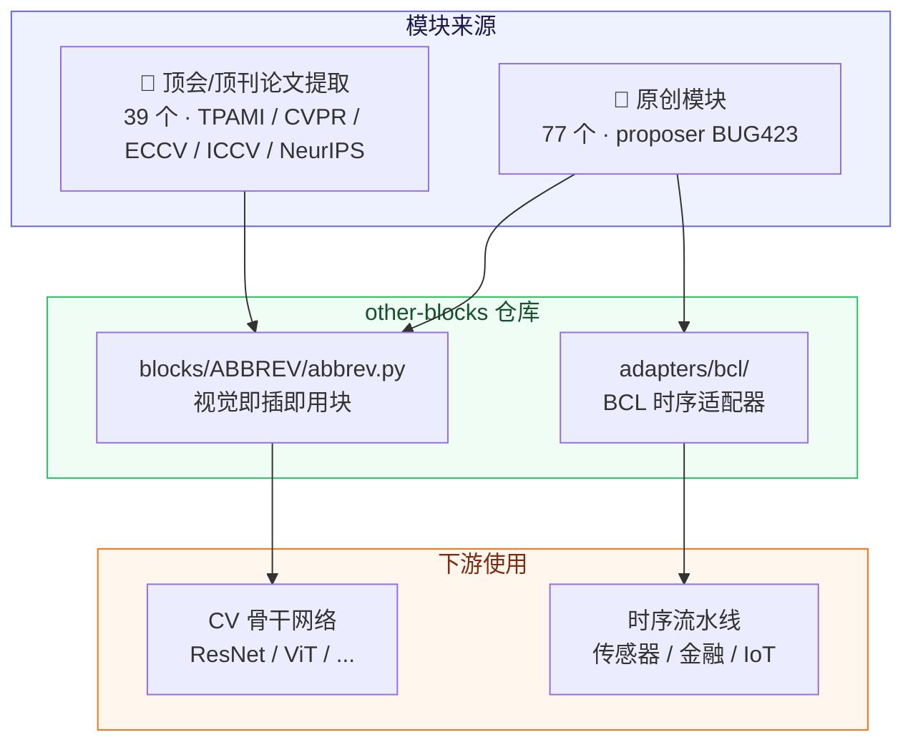
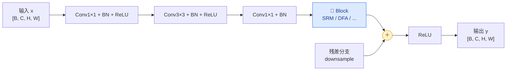
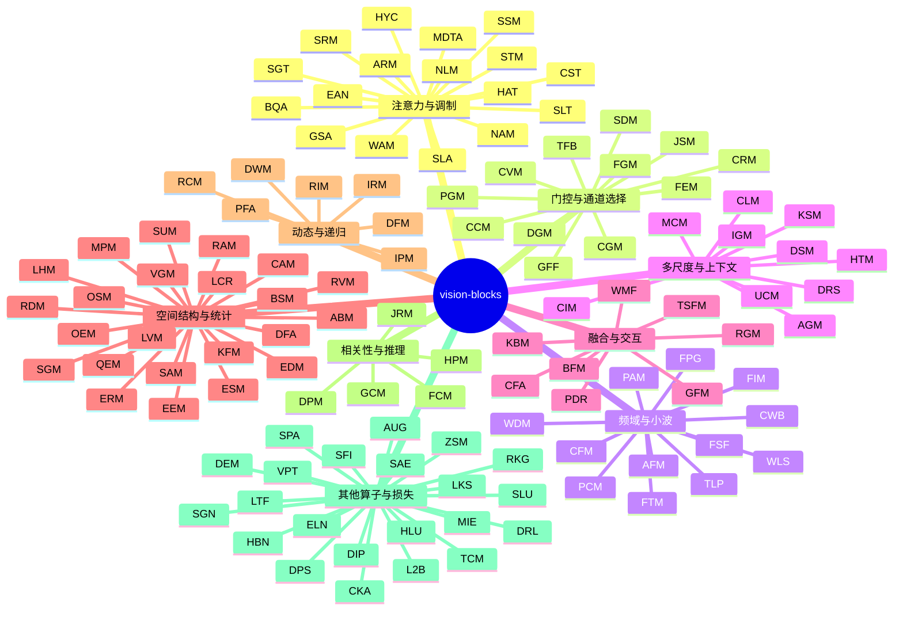

# 🔷 other-blocks

[](https://www.python.org/)
[](https://pytorch.org/)
[](https://creativecommons.org/licenses/by-nc-nd/4.0/)
[](#-模块总览)
[](#a-顶会顶刊论文提取模块)
[](#b-原创模块)

> **other-blocks** 是一个系统整理、实现和验证神经网络功能模块的开源仓库，覆盖计算机视觉（2D）与时序数据（1D BCL 序列）感知任务的即插即用 PyTorch 神经网络模块动物园。

---

## 📑 目录

- [✨ 项目特性](#-项目特性)
- [🏗️ 架构总览](#️-架构总览)
- [🧠 模块分类](#-模块分类)
- [📊 统计速览](#-统计速览)
- [📚 模块总览](#-模块总览)
- [🚀 快速开始](#-快速开始)
- [🔌 统一接口契约](#-统一接口契约)
- [🧭 如何添加模块](#-如何添加模块)
- [📄 知识产权与开源协议](#-知识产权与开源协议)

---

## ✨ 项目特性

| | |
|:---:|:---|
| 🧩 **即插即用** | 每个模块是独立的 `nn.Module`，插入任意 CNN / Transformer 骨干即可 |
| 📐 **统一张量接口** | 默认 `[B, C, H, W] → [B, C, H, W]`，形状保持，构造器首参为 `channels` |
| 🧪 **双来源模块** | 原创实验模块（BUG423 提出）+ 顶会/顶刊论文等价提取（IEEE TPAMI / CVPR / ECCV / ICCV / NeurIPS） |
| 🌊 **时序适配** | `adapters/bcl/`（及 `bcl` 分支）提供 BCL 时序格式适配器，把 1D 模块接到时序流水线 |
| 📝 **文档完整** | 每个模块带四段式中文文档：简介 / 结构 / 论文写法 / 适用任务 |
| ⚡ **零第三方依赖** | 纯 `torch` + `typing` + `math`，无 einops / timm / mamba 等外部依赖 |

---

## 🏗️ 架构总览

### 仓库结构与模块流向



### 在 ResNet 残差块中插入模块



> 插入点约定：**卷积之后、残差相加之前**。详见 [`resnet_insert_example.py`](resnet_insert_example.py)。

---

## 🧠 模块分类



| 类别 | 说明 | 代表模块 |
|------|------|----------|
| 🎯 **注意力与调制** | 通道 / 空间 / 全局注意力、非局部、槽注意力、超连接、转置注意力、外部注意力 | SRM · WAM · BQA · SLA · GSA · SLT · HYC · MDTA · EAN |
| 🚪 **门控与通道选择** | SE 系、条件原型、渐进门控、通道相关性 | CGM · PGM · CRM · TFB |
| 🌊 **频域与小波** | DCT / FFT / Haar 小波、相位处理、低通滤波 | AFM · FIM · WDM · CWB · FPG · TLP · FSF |
| 🔍 **多尺度与上下文** | 感受野选择、粗细互调、上下文混合 | DRS · DSM · CIM · UCM |
| 🔗 **融合与交互** | 多分支 / 跨模态 / 全局-局部融合 | GFF · TSFM · CFA · WMF |
| 📐 **空间结构与统计** | 边缘、方差、熵、直方图、归一化 | DFA · SGM · LVM · QEM · KFM |
| 🔁 **动态与递归** | 动态权重、专家路由、递归 / 渐进精炼 | IRM · RIM · PFA · DWM |
| 🧮 **相关性与推理** | 特征 / 梯度相关性、密集预测、联合推理 | FCM · GCM · DPM · JRM |
| 🧰 **其他算子与损失** | 进化、补全、移位、位置对齐、激活、损失、增强、后处理 | DEM · TCM · DPS · SPA · CKA · ELN · AUG · SLU · L2B · HLU · RKG |

---

## 📊 统计速览

<div align="center">

| 📦 模块总数 | 🧪 原创 | 📄 论文提取 | 🔌 BCL 时序适配器 |
|:-----------:|:------:|:----------:|:-----------------:|
| **116** | **77** | **39** | **40** |

</div>

**论文提取模块 · 期刊与会议分布**

| 期刊 / 会议 | 数量 | 模块 |
|-------------|:----:|------|
| IEEE TPAMI | 2 | MDTA · EAN |
| CVPR 2026 | 12 | BQA · ELN · FPG · SLA · SLU · L2B · FSF · LKS · SGN · SFI · VPT · SAE |
| ECCV 2026 | 9 | CFA · CST · DPS · HAT · SLT · SPA · HLU · DIP · DRL |
| ICCV 2025 | 7 | CKA · CWB · GSA · TFB · UCM · MIE · LTF |
| NeurIPS 2026 | 3 | AUG · HYC · WMF |
| NeurIPS 2025 / JMLR | 6 | TLP · RKG · HBN · SGT · ZSM · WLS |

**许可证分布（论文提取模块）**

| 许可证 | 数量 |
|--------|:----:|
| MIT | 25 |
| Apache-2.0 | 12 |
| BSD 系（Clear BSD / BSD-3-Clause） | 2 |

---

## 📚 模块总览

### A. 顶会/顶刊论文提取模块

> 从 IEEE TPAMI / CVPR 2026 / ECCV 2026 / NeurIPS 2026-2025 / ICCV 2025 论文官方代码中等价提取。
> **请引用原论文**；代码版权归原仓库许可证约束。

| 模块 | 论文 | 会议 / 期刊 | 许可证 | 核心思想 | 代码文件 |
|------|------|------------|--------|----------|----------|
| **MDTA** | [Restormer: Efficient Transformer for High-Resolution Image Restoration](https://arxiv.org/abs/2111.09881) | IEEE TPAMI 2022 | MIT | 深度卷积嵌入局部空间上下文，通道维转置自注意力（O(C^2 HW) 线性复杂度） | [`blocks/MDTA/mdta.py`](blocks/MDTA/mdta.py) |
| **EAN** | [Beyond Self-Attention: External Attention Using Two Linear Layers for Visual Tasks](https://arxiv.org/abs/2105.02358) | IEEE TPAMI 2023 | Clear BSD | 双外置共享记忆单元与双重归一化（Double Normalization），线性复杂度 O(S·N) | [`blocks/EAN/ean.py`](blocks/EAN/ean.py) |
| **BQA** | [BinaryAttention: One-Bit QK-Attention for Vision and Diffusion Transformers](https://arxiv.org/abs/2603.09582) | CVPR 2026 | Apache-2.0 | 1-bit QK 量化注意力，压缩 softmax 注意力的算力与访存瓶颈 | [`blocks/BQA/bqa.py`](blocks/BQA/bqa.py) |
| **ELN** | [Enhancing Out-of-Distribution Detection with Extended Logit Normalization](https://arxiv.org/abs/2504.11434) | CVPR 2026 | MIT | 扩展 Logit 归一化**损失**（hyperparameter-free），提升 OOD 检测 | [`blocks/ELN/eln.py`](blocks/ELN/eln.py) |
| **FPG** | [PFGNet: A Fully Convolutional Frequency-Guided Peripheral Gating Network](https://arxiv.org/abs/2602.20537) | CVPR 2026 | Apache-2.0 | 频率分解（Sobel/Laplacian/局部方差）引导中心/外周门控 | [`blocks/FPG/fpg.py`](blocks/FPG/fpg.py) |
| **SLA** | [SAT: Selective Aggregation Transformer for Image Super-Resolution](https://arxiv.org/abs/2604.07994) | CVPR 2026 Findings | MIT | 聚类合并 token 的选择性聚合注意力，降低超分注意力开销 | [`blocks/SLA/sla.py`](blocks/SLA/sla.py) |
| **CFA** | [AMG-Fuse: Multi-modality Image Fusion under Adverse Weather](https://arxiv.org/abs/2606.26812) | ECCV 2026 | MIT | 通道维注意力 + SE 门控融合，恶劣天气可见光-红外融合 | [`blocks/CFA/cfa.py`](blocks/CFA/cfa.py) |
| **CST** | [CUST: Clustered Unit-level Similarity Transformer for Lightweight Image SR](https://arxiv.org/abs/2607.11088) | ECCV 2026 | MIT | 聚簇单元级相似度注意力：簇分配 + 同簇掩码滑窗 KV | [`blocks/CST/cst.py`](blocks/CST/cst.py) |
| **DPS** | [SAM+D: Parameter-Efficient Dimensional Lifting of SAM via Depth-Routed LoRA](https://arxiv.org/abs/2607.29033) | ECCV 2026 | MIT | 零参数邻域深度移位算子（boundary-preserving shift） | [`blocks/DPS/dps.py`](blocks/DPS/dps.py) |
| **HAT** | [AMG-Fuse: Multi-modality Image Fusion under Adverse Weather](https://arxiv.org/abs/2606.26812) | ECCV 2026 | MIT | 动态直方图自注意力：排序 + box/交错分组双分支 | [`blocks/HAT/hat.py`](blocks/HAT/hat.py) |
| **SLT** | [SSync: Selective Synergistic Learning for Video Object-Centric Learning](https://arxiv.org/abs/2606.15527) | ECCV 2026 | MIT | 槽注意力（slot attention）：槽间竞争 + GRU 更新 | [`blocks/SLT/slt.py`](blocks/SLT/slt.py) |
| **SPA** | [HRDiT: Training-Free High-Resolution Image Generation with Off-the-Shelf DiT](https://arxiv.org/abs/2608.07003) | ECCV 2026 | MIT | bundle 位置 id 对齐变体平均（RoPE-friendly 位置对齐） | [`blocks/SPA/spa.py`](blocks/SPA/spa.py) |
| **CKA** | [SL²A-INR: Single-Layer Learnable Activation for Implicit Neural Representation](https://arxiv.org/abs/2409.10836) | ICCV 2025 | MIT | Chebyshev 多项式可学习激活（ChebyKAN 风格） | [`blocks/CKA/cka.py`](blocks/CKA/cka.py) |
| **CWB** | [CWNet: Causal Wavelet Network for Low-Light Image Enhancement](https://github.com/bywlzts/CWNet-Causal-Wavelet-Network) | ICCV 2025 | MIT | 因果 Haar 小波分解-增强-重建（LL 增强 + 高频细节） | [`blocks/CWB/cwb.py`](blocks/CWB/cwb.py) |
| **GSA** | [GREAT-Stereo: Global Regulation and Excitation via Attention Tuning](https://openaccess.thecvf.com/content/ICCV2025/papers/Li_Global_Regulation_and_Excitation_via_Attention_Tuning_for_Stereo_Matching_ICCV_2025_paper.pdf) | ICCV 2025 | Apache-2.0 | sink competition 全局竞争重归一化空间注意力 | [`blocks/GSA/gsa.py`](blocks/GSA/gsa.py) |
| **TFB** | [TinyNeXt: An Efficient Hybrid Vision Transformer for TinyML Applications](https://openaccess.thecvf.com/content/ICCV2025/papers/Zeng_An_Efficient_Hybrid_Vision_Transformer_for_TinyML_Applications_ICCV_2025_paper.pdf) | ICCV 2025 | MIT | SE 门控 + DW 卷积 + MLP 三残差轻量 CNN 块（实现类 SEB） | [`blocks/TFB/seb.py`](blocks/TFB/seb.py) |
| **UCM** | [UniConvNet: Expanding Effective Receptive Field while Maintaining Asymptotically Gaussian Distribution](https://arxiv.org/abs/2508.09000) | ICCV 2025 | MIT | 逐级扩张 DW 卷积核的卷积调制（ConvMod） | [`blocks/UCM/ucm.py`](blocks/UCM/ucm.py) |
| **WMF** | [WaveMamba: Wave-Inspired Cross-Modal Fusion for Event-Image Segmentation](https://github.com/adeelferozmirza/WaveMamba) | NeurIPS 2026 | MIT | 波式多膨胀率 PointConv 门控融合（事件-图像跨模态） | [`blocks/WMF/wmf.py`](blocks/WMF/wmf.py) |
| **SLU** | [LSM: Linear Recurrent Unit with Semantic Modulation for Image Super-Resolution](https://arxiv.org/abs/2606.19901) | CVPR 2026 Findings | Apache-2.0 | 语义字典调制的线性循环单元（LRU）+ 并行前缀扫描 | [`blocks/SLU/slu.py`](blocks/SLU/slu.py) |
| **L2B** | [AD-GBC: Anisotropic Granular-Ball Skip-Connection Refiner](https://github.com/SiaShen-dot/AD-GBC) | CVPR 2026 | MIT | 各向异性可微粒球聚类重加权 + Lo2 局部算子块 | [`blocks/L2B/l2b.py`](blocks/L2B/l2b.py) |
| **FSF** | [Spectral Scalpel: Frequency-Selective Filtering for Action Segmentation](https://github.com/HaoyuJi/SpecScalpel) | CVPR 2026 | MIT | FFT 实/虚可学习调制 + 动态路由选择性滤波（2D 适配） | [`blocks/FSF/fsf.py`](blocks/FSF/fsf.py) |
| **HLU** | [Hybrid-LUT: Channel-Aware Hybrid Lookup Table and Filtering](https://arxiv.org/abs/2608.11646) | ECCV 2026 | MIT | 三线性 LUT 插值 + 通道统计 softmax 混合多 LUT | [`blocks/HLU/hlu.py`](blocks/HLU/hlu.py) |
| **AUG** | [AuGhostmentation: The Eyes Never Stand Still—Why Should CNNs?](https://openreview.net/forum?id=UrYjjK6We7) | NeurIPS 2026 | MIT | 仿眼球微扫视的训练期随机位移增强（eval 恒等） | [`blocks/AUG/aug.py`](blocks/AUG/aug.py) |
| **HYC** | [s2HC: Spectral-Sphere-Constrained Hyper-Connections](https://arxiv.org/abs/2603.20896) | NeurIPS 2026 | Apache-2.0 | 多流残差超连接（谱球约束 Cayley 混合矩阵） | [`blocks/HYC/hyc.py`](blocks/HYC/hyc.py) |
| **TLP** | [Alias-Free ViT: Fractional Shift Invariance via Linear Attention](https://github.com/hmichaeli/alias_free_vit) | NeurIPS 2025 | Apache-2.0 | 截断式 FFT 低通滤波（抗混叠 / 分数平移等变） | [`blocks/TLP/tlp.py`](blocks/TLP/tlp.py) |
| **RKG** | [RankSEG: Consistent Ranking-Based Framework for Segmentation](https://www.jmlr.org/papers/v24/22-0712.html) | JMLR 2023 + NeurIPS 2025 | BSD-3-Clause | Dice/IoU 一致性排序重标注后处理（RMA 求解器） | [`blocks/RKG/rkg.py`](blocks/RKG/rkg.py) |
| **LKS** | [UCAN: Unified Convolutional Attention Network for Lightweight SR](https://arxiv.org/abs/2603.11680) | CVPR 2026 | Apache-2.0 | 大核空间注意力 LKSA：膨胀深度卷积核扩展有效感受野 | [`blocks/LKS/lks.py`](blocks/LKS/lks.py) |
| **SGN** | [UCAN: Unified Convolutional Attention Network for Lightweight SR](https://arxiv.org/abs/2603.11680) | CVPR 2026 | Apache-2.0 | 空间门控特征融合 SGFN | [`blocks/SGN/sgn.py`](blocks/SGN/sgn.py) |
| **SFI** | [LaDy: Lagrangian-Dynamic Informed Network via Spatial-Temporal Modulation](https://github.com/HaoyuJi/LaDy) | CVPR 2026 | MIT | 空间特征注入 + 动态融合（时空调制） | [`blocks/SFI/sfi.py`](blocks/SFI/sfi.py) |
| **VPT** | [FOZO: Forward-Only Zeroth-Order Prompt Optimization for TTA](https://arxiv.org/abs/2603.04733) | CVPR 2026 | MIT | 视觉可学习 prompt 注入调制 | [`blocks/VPT/vpt.py`](blocks/VPT/vpt.py) |
| **DIP** | [DIPE: Inter-Modal Distance Invariant Position Encoding](https://arxiv.org/abs/2603.10863) | ECCV 2026 | MIT | 跨模态距离不变 RoPE 相位重排 | [`blocks/DIP/dip.py`](blocks/DIP/dip.py) |
| **DRL** | [SAM+D: Depth-Routed LoRA and Depth Shifting](https://arxiv.org/abs/2607.29033) | ECCV 2026 | MIT | 深度路由低秩专家混合适配器 | [`blocks/DRL/drl.py`](blocks/DRL/drl.py) |
| **MIE** | [MobileIE: Extremely Lightweight ConvNet for Real-Time Enhancement](https://arxiv.org/abs/2507.01838) | ICCV 2025 | Apache-2.0 | 超轻量实时图像增强卷积块 | [`blocks/MIE/mie.py`](blocks/MIE/mie.py) |
| **LTF** | [LUT-Fuse: Extremely Fast IR-VIS Fusion via Learnable LUTs](https://github.com/zyb5/LUT-Fuse) | ICCV 2025 | MIT | 可学习查找表融合单元 | [`blocks/LTF/ltf.py`](blocks/LTF/ltf.py) |
| **HBN** | [HybridNorm: Stable and Efficient Transformer Training](https://arxiv.org/abs/2503.04598) | NeurIPS 2025 | Apache-2.0 | QKV-norm + FFN Post-Norm 混合归一化 | [`blocks/HBN/hbn.py`](blocks/HBN/hbn.py) |
| **SGT** | [SeerAttention: Self-distilled Attention Gating](https://arxiv.org/abs/2410.13276) | NeurIPS 2025 | MIT | 块级可训练稀疏注意力门控 | [`blocks/SGT/sgt.py`](blocks/SGT/sgt.py) |
| **ZSM** | [ZigzagPointMamba: Spatial-Semantic Mamba for Point Cloud](https://github.com/Rabbitttttt218/ZigzagPointMamba) | NeurIPS 2025 | Apache-2.0 | zigzag 空间-语义双向扫描混合 | [`blocks/ZSM/zsm.py`](blocks/ZSM/zsm.py) |
| **WLS** | [WaLRUS: Wavelets for Long-range Representation Using SSM](https://github.com/echbaba/walrus) | NeurIPS 2025 | Apache-2.0 | 小波多尺度分解 + 逐子带状态空间递推 | [`blocks/WLS/wls.py`](blocks/WLS/wls.py) |
| **SAE** | [Sparsemax SAE: Improving Sparse Autoencoder with Dynamic Attention](https://github.com/qyj-bkjx/Sparsemax-SAE) | CVPR 2026 | MIT | Sparsemax 动态稀疏自编码器（可解释稀疏特征） | [`blocks/SAE/sae.py`](blocks/SAE/sae.py) |

<details>
<summary>📌 论文提取约定（点击展开）</summary>

- 等价重写：只允许改命名、删依赖、统一接口、硬编码参数化；**数值逻辑逐行保持**。
- 头注释保留：论文标题 / venue / 链接 / 代码来源 / 原始许可证 / 模块出处 / 重构说明。
- 若原实现天然为 1D/3D/token 接口，在类内 reshape 适配到 4D `[B,C,H,W]`。

</details>

### B. 原创模块

> 由 **BUG423** 提出的实验性模块，**尚未发表**。欢迎在你的任务上做消融验证。

<details open>
<summary>点击折叠 / 展开完整表格（77 个原创）</summary>

| 模块 | 名称 | 核心思想 | 适用任务 |
|------|------|----------|----------|
| **ABM** | Adaptive Batch Module · 自适应批归一化 | 内容感知统计量 → 双重调制均值方差 | 分类 / 风格迁移 |
| **AFM** | Adaptive Frequency Modulation · 自适应频率调制 | 多核并行近似频带 + 空间自适应调制 | 分类 / 检测 / 恢复 |
| **AGM** | Adaptive Granularity Module · 自适应粒度 | 粒度偏好图驱动粗细分支软插值 | 分类 / 检测 / 分割 |
| **ARM** | Attention Refinement Module · 注意力精炼 | 迭代残差精炼 + 精炼门控 | 分类 / 检测 / 分割 |
| **BFM** | Batch Fusion Module · 批融合 | 批内统计 + 样本间注意力交互 | 分类 / 度量学习 |
| **BSM** | Bilateral Similarity Module · 双边相似度 | 邻域内容相似度双边加权聚合 | 分类 / 检测 / 分割 |
| **CAM** | Contrast-Aware Module · 对比度感知 | 局部对比度驱动锐化 / 平滑双路径 | 分类 / 检测 / 边缘 |
| **CCM** | Channel Correlation Module · 通道相关性 | 通道相关性矩阵低秩近似增强 | 分类 / 检测 / 分割 |
| **CFM** | Channel Frequency Mixer · 通道频率混合 | DCT 频域跨通道频率信息交换 | 分类 / 检测 / 分割 |
| **CGM** | Conditional Gating Module · 条件门控 | 可学习条件原型相似度驱动门控 | 分类 / 检测 / 分割 |
| **CIM** | Contextual Information Modulator · 上下文调制 | 逐位置局部 vs 全局上下文混合比例 | 分类 / 检测 / 分割 |
| **CLM** | Context Learning Module · 上下文学习 | 多类型上下文自适应选择融合 | 分割 / 场景理解 |
| **CRM** | Channel Recalibration Module · 通道重校准 | 激活熵引导的通道重校准 | 分类 / 检测 / 分割 |
| **CVM** | Channel Variance Module · 通道方差 | 方差引导通道增强 / 抑制 | 分类 / 特征选择 |
| **DEM** | Dense Evolution Module · 密集进化 | 变异-选择-保留进化式密集连接 | 分类 / 检测 / 分割 |
| **DFA** | Differential Feature Amplifier · 差异性特征放大 | 局部邻域差异驱动放大 | 分类 / 检测 / 边缘 |
| **DFM** | Dynamic Feature Module · 动态特征 | 输入自适应动态参数生成 | 分类 / 风格迁移 |
| **DGM** | Diversity-Guided Module · 多样性引导 | Gram 冗余分数抑制通道坍塌 | 分类 / 检测 / 分割 |
| **DPM** | Dense Prediction Module · 密集预测 | 逐位置密集预测头 + 全局局部融合 | 分割 / 深度估计 |
| **DRS** | Dynamic Receptive Field Selector · 动态感受野 | 逐位置软选择膨胀率 | 检测 / 分割 |
| **DSM** | Dual-Scale Modulator · 双尺度调制 | 粗细双尺度互调（上下文 + 细节回注） | 分类 / 检测 / 分割 |
| **DWM** | Dynamic Weight Module · 动态权重 | 轻量调制因子动态化卷积权重 | 分类 / 风格迁移 |
| **EDM** | Entropy-Driven Module · 熵驱动 | 局部信息熵驱动增强 / 压缩 | 分类 / 检测 / 分割 |
| **EEM** | Energy Equalization Module · 能量均衡 | 通道 + 空间能量双重均衡 | 分类 / 检测 / 分割 |
| **ERM** | Edge Response Module · 边缘响应 | 显式边缘响应提取与增强 | 边缘 / 分割 / 检测 |
| **ESM** | Enhanced Spatial Module · 增强空间 | 增强空间编码与自适应采样 | 检测 / 分割 / 姿态 |
| **FCM** | Feature Correlation Module · 特征相关性 | 低秩全局相关性引导增强 | 分类 / 检测 / 分割 |
| **FEM** | Feature Equilibrium Module · 特征均衡 | 通道均衡能量学习与调节 | 分类 / 检测 / 分割 |
| **FGM** | Feature Gating Module · 特征门控 | 协作门控 + 双向通道交互 | 分类 / 检测 / 分割 |
| **FIM** | Frequency Importance Module · 频率重要性 | DCT 频率重要性学习与重标定 | 分类 / 检测 / 分割 |
| **FTM** | Frequency Transform Module · 频率变换 | Haar 近似 DCT + 频带选择增强 | 分类 / 恢复 / 去噪 |
| **GCM** | Gradient Correlation Module · 梯度相关性 | 梯度方向相关性引导增强 | 边缘 / 分割 / 纹理 |
| **GFF** | Gated Feature Fusion · 门控特征融合 | 三路并行 + 空间通道联合门控 | 分类 / 检测 / 分割 |
| **GFM** | Global Fusion Module · 全局融合 | 全局语义与局部细节自适应融合 | 分类 / 分割 / 理解 |
| **HPM** | Hierarchical Prediction Module · 层次预测 | 多层次预测渐进精炼融合 | 分割 / 检测 / 深度 |
| **HTM** | Hierarchical Transformation Module · 层次变换 | 三阶段递进变换 + 信息桥接 | 分类 / 检测 / 分割 |
| **IGM** | Information Gathering Module · 信息汇聚 | 多尺度深度可分离按需汇聚 | 分类 / 检测 / 分割 |
| **IPM** | Iterative Processing Module · 迭代处理 | 迭代处理 + 残差累积 + 自适应次数 | 恢复 / 去噪 / 超分 |
| **IRM** | Information Routing Module · 信息路由 | 多专家内容感知路由混合 | 分类 / 检测 / 分割 |
| **JRM** | Joint Reasoning Module · 联合推理 | 空间 / 语义 / 上下文多关系联合推理 | 场景理解 / VQA |
| **JSM** | Joint Selection Module · 联合选择 | 空间-通道联合稀疏选择 | 分类 / 检测 / 分割 |
| **KBM** | Knowledge Bridge Module · 知识桥接 | 跨层语义对齐与桥接传递 | 多尺度融合 |
| **KFM** | Kalman Filter Module · 卡尔曼滤波 | 预测-更新卡尔曼增益融合 | 分类 / 检测 / 分割 |
| **KSM** | Kernel Selection Module · 核选择 | 逐位置可微分核大小软选择 | 分类 / 检测 / 分割 |
| **LCR** | Local Context Reconstructor · 局部上下文重构 | 逐位置动态邻域重构权重 | 分类 / 检测 / 分割 |
| **LHM** | Local Histogram Module · 局部直方图 | soft binning 可微分直方图 | 分类 / 异常检测 |
| **LVM** | Local Variance Modulator · 局部方差调制 | 局部方差双路细节 / 抑制调制 | 分类 / 检测 / 分割 |
| **MCM** | Multi-Scale Context Module · 多尺度上下文 | 自适应尺度权重多尺度上下文 | 分割 / 检测 / 分类 |
| **MPM** | Momentum Propagation Module · 动量传播 | 动量参考 + 瞬态偏差感知调制 | 分类 / 检测 / 分割 |
| **NAM** | Neural Attention Module · 神经注意力 | 多尺度注意力并行与融合 | 分类 / 检测 / 分割 |
| **NLM** | Non-local Modulation Module · 非局部调制 | 非局部亲和力做调制而非聚合 | 分类 / 检测 / 分割 |
| **OEM** | Order-Statistic Enhancement Module · 序统计增强 | 软排序序统计量鲁棒聚合 | 分类 / 检测 / 分割 |
| **OSM** | Offset Spatial Mixing · 偏移空间混合 | 可变形偏移 + 连续性约束 | 分类 / 检测 / 分割 |
| **PAM** | Phase Alignment Module · 相位对齐 | Gabor 局部相位估计与对齐 | 融合 / 恢复 |
| **PCM** | Phase-Coherence Module · 相位一致性 | FFT 幅度 / 相位解耦差异化处理 | 分类 / 检测 / 分割 |
| **PDR** | Polarized Dual Representation · 极化双表示 | 空间 / 语义双通路交叉门控 | 分类 / 检测 / 分割 |
| **PFA** | Progressive Feature Aggregator · 渐进式聚合 | 两阶段粗调-精调残差累积 | 分类 / 检测 / 分割 |
| **PGM** | Progressive Gating Module · 渐进式门控 | 三阶段级联门控（粗→中→细） | 分类 / 检测 / 分割 |
| **QEM** | Quantile Enhancement Module · 分位数增强 | 分位数鲁棒归一化与增强 | 分类 / 检测 / 分割 |
| **RAM** | Residual Amplification Module · 残差放大 | 基座-残差分解内容感知放大 | 分类 / 检测 / 分割 |
| **RCM** | Recursive Convolution Module · 递归卷积 | 权重共享递归 + 终止门自适应深度 | 分类 / 检测 / 分割 |
| **RDM** | Reaction-Diffusion Module · 反应扩散 | Turing 反应扩散动力学演化 | 分类 / 检测 / 分割 |
| **RGM** | Reciprocal Guidance Module · 互惠引导 | 通道-空间双分支互惠引导 | 分类 / 检测 / 分割 |
| **RIM** | Recursive Inference Module · 递归推理 | 权重共享递归推理逐步精炼 | 分类 / 检测 / 分割 |
| **RVM** | Random Variation Module · 随机变异 | 特征级可控随机注入增强 | 分类 / 鲁棒性 |
| **SAM** | Spatial Affinity Module · 空间亲和力 | 低秩空间亲和力信息传播 | 分割 / 检测 / 生成 |
| **SDM** | Spectral Decomposition Module · 谱分解 | 通道协方差谱分解子空间滤波 | 分类 / 检测 / 分割 |
| **SGM** | Spatial Gradient Modulator · 空间梯度调制 | Sobel 梯度幅值-方向联合调制 | 分类 / 检测 / 边缘 |
| **SRM** | Selective Response Module · 选择性响应 | 位置敏感通道调制 + 软阈值稀疏 | 分类 / 检测 / 分割 |
| **SSM** | Saliency-Guided Suppression · 显著性引导抑制 | 显著性软抑制重分配注意力预算 | 分类 / 检测 / 分割 |
| **STM** | Spatial-Channel Transformer · 空间-通道变换 | 空间-通道双向交叉注意力 | 分类 / 检测 / 分割 |
| **SUM** | Spatial Uncertainty Module · 空间不确定性 | 不确定性引导平滑 / 保持双路径 | 分类 / 检测 / 分割 |
| **TCM** | Tensor Completion Module · 张量补全 | 低秩张量补全修复退化信息 | 分类 / 检测 / 分割 |
| **TSFM** | Temporal-Spatial Fusion · 时序-空间融合 | 空间-通道交叉注意力联合建模 | 分类 / 检测 / 分割 |
| **VGM** | Variational Gaussian Mixing · 变分高斯混合 | 变分推断不确定性感知混合 | 分类 / 检测 / 分割 |
| **WAM** | Weighted Attention Module · 加权注意力 | 四模式注意力并行加权融合 | 分类 / 检测 / 分割 |
| **WDM** | Wavelet Decomposition Module · 小波分解 | Haar 子带精炼 + 软阈值去噪 | 分类 / 恢复 / 去噪 |

</details>

---

## 🚀 快速开始

### 安装

```bash
git clone https://github.com/BUG423/vision-blocks.git
cd vision-blocks
pip install torch   # Python >= 3.9, PyTorch >= 2.0
```

### 1. 原创模块：即插即用

```python
import torch
from blocks.SRM.srm import SRM

srm = SRM(channels=64)                       # 统一契约：首参 channels
x = torch.randn(1, 64, 32, 32)               # [B, C, H, W]
print(srm(x).shape)                          # torch.Size([1, 64, 32, 32])
```

### 2. 论文提取模块：同一契约

```python
from blocks.MDTA.mdta import MDTA    # IEEE TPAMI 2022 · Restormer（多深度卷积头转置注意力）
from blocks.EAN.ean import EAN      # IEEE TPAMI 2023 · EANet（外部注意力机制）
from blocks.BQA.bqa import BQA      # CVPR 2026 · BinaryAttention（1-bit 量化注意力）
from blocks.FPG.fpg import FPG      # CVPR 2026 · PFGNet（频域门控）
from blocks.WMF.wmf import WMF      # NeurIPS 2026 · WaveMamba（跨模态融合）

x = torch.randn(2, 64, 32, 32)
print(MDTA(channels=64)(x).shape)   # [2, 64, 32, 32]
print(EAN(channels=64)(x).shape)    # [2, 64, 32, 32]
print(BQA(channels=64)(x).shape)    # [2, 64, 32, 32]
print(FPG(channels=64)(x).shape)    # [2, 64, 32, 32]
print(WMF(channels=64)(x).shape)    # [2, 64, 32, 32]
```

### 3. 接口例外模块（损失 / 后处理 / 训练期增强）

少数模块按其论文语义不保持 `[B,C,H,W]→[B,C,H,W]`，已在表中和文件头标明：

```python
import torch
from blocks.ELN.eln import ELN      # 损失：logits + 权重 + label → 标量
from blocks.RKG.rkg import RKG      # 后处理：概率图 [B,K,H,W] → 标签 [B,H,W]
from blocks.AUG.aug import AUG      # 训练期增强：train() 有扰动，eval() 恒等

# ELN —— 训练损失
crit = ELN()
loss = crit(torch.randn(8, 10), torch.randn(10, 16), torch.randint(0, 10, (8,)))
print(loss.shape)                   # torch.Size([])

# RKG —— 分割评测后处理
rkg = RKG(metric='dice')
labels = rkg(torch.rand(2, 5, 32, 32).softmax(1))
print(labels.shape)                 # torch.Size([2, 32, 32])

# AUG —— 数据增强（eval 恒等）
aug = AUG(image_size=64)
aug.eval()
x = torch.randn(1, 3, 64, 64)
print(torch.equal(aug(x), x))       # True
```

### 4. 完整骨干插入示例

```python
# 见 resnet_insert_example.py —— 在 Bottleneck 的 conv3 之后、残差相加之前插入
from resnet_insert_example import ResNet50

model = ResNet50(num_classes=1000, attention_type='srm')   # 或 dfa / cim / gff / ...
print(model(torch.randn(1, 3, 224, 224)).shape)             # [1, 1000]
```

### 5. BCL 时序适配器与模块

本仓库提供针对一维时序数据（如传感器、心电、行情）的 BCL 格式支持（输入布局 `[batch, channels, time]`）：
- 在 `main` 分支可通过 `adapters/bcl/` 直接调用；
- 或切换至专属时序分支 `git checkout bcl` 获取独立时序工程。

```python
import torch
from adapters.bcl.mdta_bcl import MDTA_BCL   # Restormer MDTA 时序版
from adapters.bcl.ean_bcl import EAN_BCL     # EANet 外部注意力时序版

x_ts = torch.randn(1, 64, 128)               # [B, C, T]
mdta_ts = MDTA_BCL(channels=64, seq_len=128)
ean_ts = EAN_BCL(channels=64, seq_len=128)

print("MDTA-BCL 输出:", mdta_ts(x_ts).shape) # [1, 64, 128]
print("EAN-BCL  输出:", ean_ts(x_ts).shape)  # [1, 64, 128]
```

---

## 🔌 统一接口契约

所有模块遵循同一契约（完整规范见 [EXTRACT_SPEC.md](EXTRACT_SPEC.md)）：

```python
class ABBREV(nn.Module):
    def __init__(self, channels: int, **task_specific_kwargs):
        ...

    def forward(self, x: torch.Tensor) -> torch.Tensor:
        """
        x:   [B, C, H, W]
        out: [B, C, H, W]   # 形状保持；例外必须在 docstring 中说明
        """
```

**约定要点**

1. 构造器**第一个参数必须是 `channels: int`**（in/out 不同时用 `in_channels, out_channels` 并写明）。
2. `forward` 默认吃 4D `[B,C,H,W]`；天然 1D/3D/token 的模块在类内 reshape 适配。
3. 默认超参与论文一致；额外超参只加必要的，并给论文默认值。
4. **禁止改变数值逻辑**：重构只允许改命名、删死代码、统一 `nn` 用法、硬编码参数化、补 shape assert。
5. 仅依赖 `torch` / `torch.nn` / `torch.nn.functional` / `typing` / `math`。

**接口例外一览**（均为论文原生语义，文件头已注明）

| 模块 | 语义 | 接口 |
|------|------|------|
| `ELN` | 训练损失 | `(logits[N,C], fc_weight[C,D], target[N]) → 标量` |
| `RKG` | 评测后处理 | `(probs[B,K,H,W]) → labels[B,H,W]` |
| `AUG` | 训练期增强 | `[B,C,H,W]→[B,C,H,W]`，但 `eval()` 恒等 |
| `WMF` / `CFA` | 双分支融合 | `forward(x, x_aux=None)`，单输入可跑 |

---

## 🧭 如何添加模块

### 新增原创模块

1. 创建目录 `blocks/<ABBREV>/<abbrev>.py`，`<ABBREV>` 为 2–5 个大写字母，不与现有目录冲突。
2. 类名与简称一致：`class ABBREV(nn.Module)`。
3. 文件头注明 `# 论文：原创模块，尚未发表` + 提出者 + 日期。
4. Docstring 使用四段式：**一、模块简介 / 二、结构设计 / 三、论文写法参考 / 四、适用任务**。
5. 文件末尾带 `count_parameters` 自检与 `if __name__ == '__main__'` 最小示例。

### 提取论文模块

1. 在文件头保留完整来源信息（论文标题 / venue / 链接 / GitHub / 许可证 / 模块出处 / 重构说明）。
2. 只做**等价重写**：删第三方依赖、统一 4D 接口、参数化硬编码；数值逻辑逐行保持。
3. 原始许可证写入头注释；对外文档注明「请引用原论文」。
4. 详细规范见 [EXTRACT_SPEC.md](EXTRACT_SPEC.md)。

---

## 📄 知识产权与开源协议

本项目遵循 **[Creative Commons Attribution-NonCommercial-NoDerivatives 4.0 International (CC BY-NC-ND 4.0)](https://creativecommons.org/licenses/by-nc-nd/4.0/)** 严格非商业开源许可：

- ❌ **严禁商用**：任何个人或组织不得将本项目源码、编译产物或衍生版本用于任何商业盈利目的。
- ❌ **禁止演绎与分发修改版**：未经授权不得散布基于本项目修改后的二次分发版本。
- 🔒 **权利保留**：作者保留对本项目代码与架构的所有版权与法律追责权利。

> 📌 **注**：论文提取模块在遵守 CC BY-NC-ND 4.0 整体非商业约束的前提下，保留原论文作者的学术署名与上游开源许可证（MIT / Apache-2.0 / BSD 等，详见各模块头部注释）。

### 引用

**两类模块、两种引用方式**，请勿混用：

| 你使用的模块 | 需要引用 |
|--------------|----------|
| **原创模块**（SRM、DFA、CIM 等 77 个） | 本仓库（下方 BibTeX） |
| **论文提取模块**（MDTA、EAN、BQA、FPG 等 39 个） | **原论文** + 本仓库 |

**论文提取模块**的论文标题、venue、链接见上表「A. 顶会/顶刊论文提取模块」；各文件头注释也带有同源信息。示例（以 `MDTA` / `BQA` 为例，请按所用模块替换）：

```bibtex
@article{zamir2022restormer,
  title   = {Restormer: Efficient Transformer for High-Resolution Image Restoration},
  author  = {Zamir, Syed Waqas and Arora, Aditya and Khan, Salman and Hayat, Munawar and Khan, Fahad Shahbaz and Yang, Ming-Hsuan},
  journal = {IEEE Transactions on Pattern Analysis and Machine Intelligence},
  volume  = {45},
  number  = {2},
  pages   = {2013--2029},
  year    = {2022}
}

@article{guo2023beyond,
  title   = {Beyond Self-Attention: External Attention Using Two Linear Layers for Visual Tasks},
  author  = {Guo, Meng-Hao and Liu, Zheng-Ning and Lu, Cheng-Ze and Sheng, Quan-Zheng and Gao, Dong-Dong and Cheng, Ming-Ming and Hu, Shi-Min},
  journal = {IEEE Transactions on Pattern Analysis and Machine Intelligence},
  volume  = {45},
  number  = {5},
  pages   = {5436--5447},
  year    = {2023}
}
```

```bibtex
@inproceedings{xiao2026binaryattention,
  title     = {BinaryAttention: One-Bit QK-Attention for Vision and Diffusion Transformers},
  author    = {Xiao, Chaodong and Zhang, Zhengqiang and Zhang, Lei},
  booktitle = {CVPR},
  year      = {2026}
}
```

引用本仓库：

```bibtex
@misc{other-blocks,
  title        = {other-blocks: Plug-and-Play PyTorch Blocks for Vision and Time-Series},
  author       = {BUG423 and other-blocks contributors},
  note         = {Experimental module zoo; validate on your own task},
  howpublished = {\url{https://github.com/BUG423/other-blocks}},
  year         = {2026}
}
```

---

## 📄 知识产权与开源协议

本项目遵循 **[Creative Commons Attribution-NonCommercial-NoDerivatives 4.0 International (CC BY-NC-ND 4.0)](https://creativecommons.org/licenses/by-nc-nd/4.0/)** 严格非商业开源许可：

- ❌ **严禁商用**：任何个人或组织不得将本项目源码、编译产物或衍生版本用于任何商业盈利目的。
- ❌ **禁止演绎与分发修改版**：未经授权不得散布基于本项目修改后的二次分发版本。
- 🔒 **权利保留**：作者保留对本平台代码与架构的所有版权与法律追责权利。

