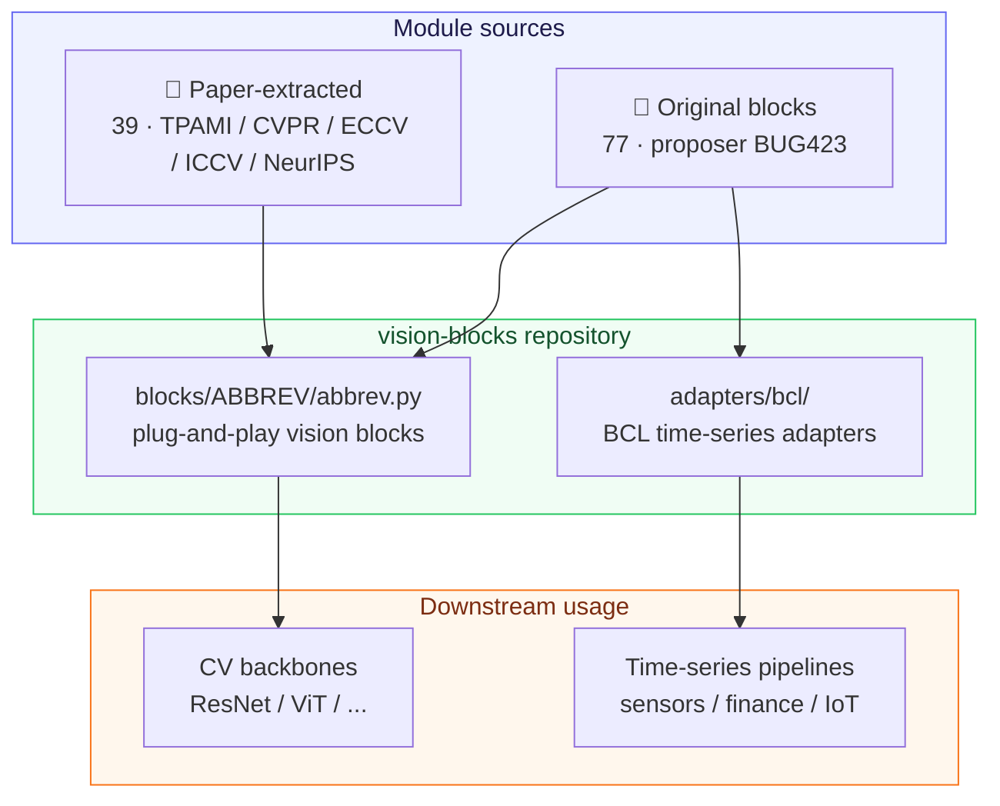
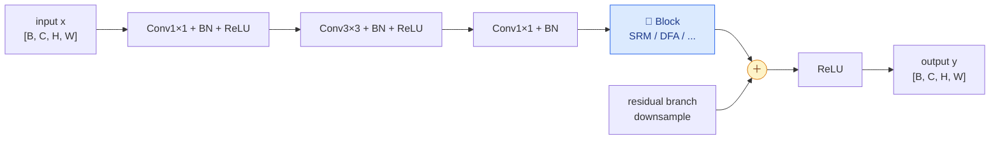
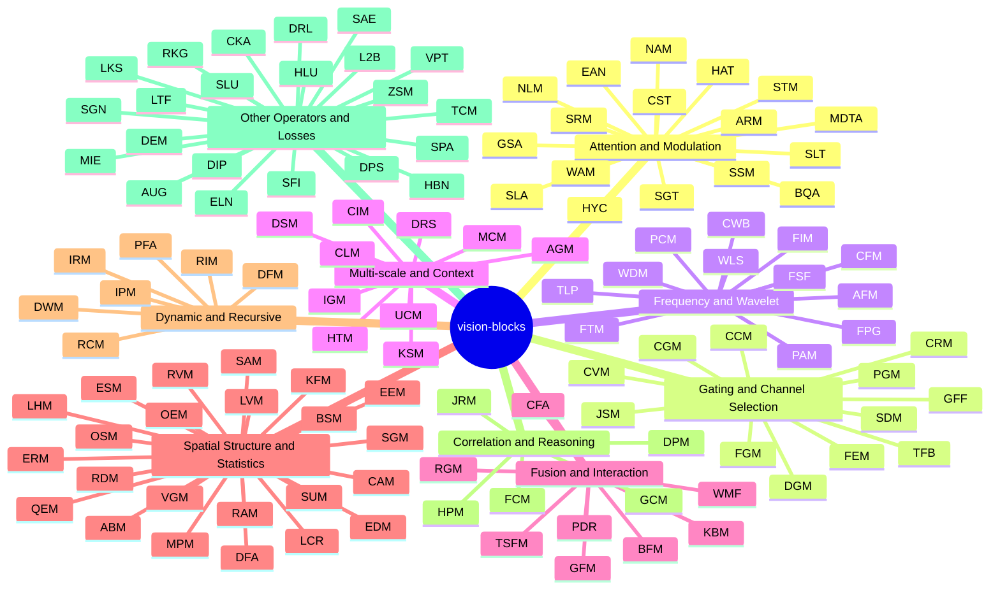

<div align="center">

# 🔷 vision-blocks

**Plug-and-Play PyTorch Blocks for Vision & Time-Series — an Experimental Module Zoo**

[](README.md)
[](README_EN.md)
<br/>
[](https://www.python.org/)
[](https://pytorch.org/)
[](https://creativecommons.org/licenses/by-nc-nd/4.0/)
[](#-module-at-a-glance)
[](#a-paper-sourced-modules)
[](#b-original-modules)
<br/>
[](#-stats-strip)
[](#-stats-strip)
[](#-stats-strip)
[](#-stats-strip)
[](#-stats-strip)<br/>
[](#-stats-strip)

A curated open-source collection of neural-network building blocks for computer vision and time-series tasks.

> ⚠️ **Honest disclaimer**: this repository is **experimental research code** (an experimental
> module zoo). It does **NOT** claim state-of-the-art results or peer review. Original modules
> are unpublished; paper-sourced modules are equivalence-preserving rewrites. Validate
> everything on your own target task before use.

</div>

---

## 📑 Table of Contents

- [✨ Highlights](#-highlights)
- [🏗️ Architecture](#️-architecture)
- [🧠 Module Categories](#-module-categories)
- [📊 Stats Strip](#-stats-strip)
- [📚 Module Catalog](#-module-catalog)
- [🚀 Quick Start](#-quick-start)
- [🔌 Unified Interface Contract](#-unified-interface-contract)
- [🧭 How to Add a Module](#-how-to-add-a-module)
- [📄 License & Intellectual Property](#-license--intellectual-property)

---

## ✨ Highlights

| | |
|:---:|:---|
| 🧩 **Plug-and-play** | Every block is a self-contained `nn.Module`; drop it into any CNN / Transformer backbone |
| 📐 **Unified tensor contract** | Default `[B, C, H, W] → [B, C, H, W]`, shape-preserving; first ctor arg is `channels` |
| 🧪 **Two module sources** | Original experimental blocks (proposed by BUG423) + equivalence-extracted journal/conference blocks (IEEE TPAMI / CVPR / ECCV / ICCV / NeurIPS) |
| 🌊 **Time-series adapters** | `adapters/bcl/` (and `bcl` branch) turn 1D modules into BCL time-series pipelines |
| 📝 **Full docstrings** | Four-part Chinese docs per module: intro / structure / paper-writing notes / tasks |
| ⚡ **Zero third-party deps** | Pure `torch` + `typing` + `math` — no einops / timm / mamba |

---

## 🏗️ Architecture

### Repository layout & module flow



### Inserting a block into a ResNet bottleneck



> Insertion point convention: **after the last convolution, before the residual add**.
> See [`resnet_insert_example.py`](resnet_insert_example.py).

---

## 🧠 Module Categories



| Category | Description | Representative blocks |
|----------|-------------|----------------------|
| 🎯 **Attention & Modulation** | Channel / spatial / global attention, non-local, slot attention, hyper-connections, transposed attention, external attention | SRM · WAM · BQA · SLA · GSA · SLT · HYC · MDTA · EAN |
| 🚪 **Gating & Channel Selection** | SE-style, conditional prototypes, progressive gating, channel correlation | CGM · PGM · CRM · TFB |
| 🌊 **Frequency & Wavelet** | DCT / FFT / Haar wavelet, phase processing, low-pass filtering | AFM · FIM · WDM · CWB · FPG · TLP · FSF |
| 🔍 **Multi-scale & Context** | Receptive-field selection, coarse-fine coupling, context mixing | DRS · DSM · CIM · UCM |
| 🔗 **Fusion & Interaction** | Multi-branch / cross-modal / global-local fusion | GFF · TSFM · CFA · WMF |
| 📐 **Spatial Structure & Statistics** | Edges, variance, entropy, histograms, normalization | DFA · SGM · LVM · QEM · KFM |
| 🔁 **Dynamic & Recursive** | Dynamic weights, expert routing, recursive / progressive refinement | IRM · RIM · PFA · DWM |
| 🧮 **Correlation & Reasoning** | Feature / gradient correlation, dense prediction, joint reasoning | FCM · GCM · DPM · JRM |
| 🧰 **Other Operators & Losses** | Evolution, completion, shifting, position alignment, activation, loss, augmentation, postprocess | DEM · TCM · DPS · SPA · CKA · ELN · AUG · SLU · L2B · HLU · RKG |

---

## 📊 Stats Strip

<div align="center">

| 📦 Total blocks | 🧪 Original | 📄 Paper-sourced | 🔌 BCL adapters |
|:---------------:|:-----------:|:----------------:|:---------------:|
| **116** | **77** | **39** | **40** |

</div>

**Paper-sourced blocks · journal & venue breakdown**

| Journal / Venue | Count | Blocks |
|-----------------|:-----:|--------|
| IEEE TPAMI | 2 | MDTA · EAN |
| CVPR 2026 | 12 | BQA · ELN · FPG · SLA · SLU · L2B · FSF · LKS · SGN · SFI · VPT · SAE |
| ECCV 2026 | 9 | CFA · CST · DPS · HAT · SLT · SPA · HLU · DIP · DRL |
| ICCV 2025 | 7 | CKA · CWB · GSA · TFB · UCM · MIE · LTF |
| NeurIPS 2026 | 3 | AUG · HYC · WMF |
| NeurIPS 2025 / JMLR | 6 | TLP · RKG · HBN · SGT · ZSM · WLS |

**License breakdown (paper-sourced blocks)**

| License | Count |
|---------|:-----:|
| MIT | 25 |
| Apache-2.0 | 12 |
| BSD family (Clear BSD / BSD-3-Clause) | 2 |

---

## 📚 Module Catalog

### A. Paper-Sourced Modules

> Equivalence-extracted from official code of IEEE TPAMI / CVPR 2026 / ECCV 2026 / NeurIPS 2026-2025 / ICCV 2025 papers.
> **Please cite the original papers**; code remains under the original upstream licenses.

| Block | Paper | Venue / Journal | License | Core idea | Code |
|-------|-------|-----------------|---------|-----------|------|
| **MDTA** | [Restormer: Efficient Transformer for High-Resolution Image Restoration](https://arxiv.org/abs/2111.09881) | IEEE TPAMI 2022 | MIT | Depthwise conv context embedding + channel transposed attention (O(C^2 HW) linear complexity) | [`blocks/MDTA/mdta.py`](blocks/MDTA/mdta.py) |
| **EAN** | [Beyond Self-Attention: External Attention Using Two Linear Layers for Visual Tasks](https://arxiv.org/abs/2105.02358) | IEEE TPAMI 2023 | Clear BSD | Dual shared external memory units + double normalization, linear complexity O(S·N) | [`blocks/EAN/ean.py`](blocks/EAN/ean.py) |
| **BQA** | [BinaryAttention: One-Bit QK-Attention for Vision and Diffusion Transformers](https://arxiv.org/abs/2603.09582) | CVPR 2026 | Apache-2.0 | 1-bit QK-quantized attention to cut softmax attention compute & memory | [`blocks/BQA/bqa.py`](blocks/BQA/bqa.py) |
| **ELN** | [Enhancing Out-of-Distribution Detection with Extended Logit Normalization](https://arxiv.org/abs/2504.11434) | CVPR 2026 | MIT | Extended Logit Normalization **loss** (hyperparameter-free) for OOD detection | [`blocks/ELN/eln.py`](blocks/ELN/eln.py) |
| **FPG** | [PFGNet: A Fully Convolutional Frequency-Guided Peripheral Gating Network](https://arxiv.org/abs/2602.20537) | CVPR 2026 | Apache-2.0 | Frequency decomposition (Sobel/Laplacian/local variance) guided center-periphery gating | [`blocks/FPG/fpg.py`](blocks/FPG/fpg.py) |
| **SLA** | [SAT: Selective Aggregation Transformer for Image Super-Resolution](https://arxiv.org/abs/2604.07994) | CVPR 2026 Findings | MIT | Cluster-and-merge selective aggregation attention for lightweight SR | [`blocks/SLA/sla.py`](blocks/SLA/sla.py) |
| **CFA** | [AMG-Fuse: Multi-modality Image Fusion under Adverse Weather](https://arxiv.org/abs/2606.26812) | ECCV 2026 | MIT | Channel-wise attention + SE-gated fusion for adverse-weather VI-IR fusion | [`blocks/CFA/cfa.py`](blocks/CFA/cfa.py) |
| **CST** | [CUST: Clustered Unit-level Similarity Transformer for Lightweight Image SR](https://arxiv.org/abs/2607.11088) | ECCV 2026 | MIT | Clustered unit-level similarity attention: cluster assignment + masked windowed KV | [`blocks/CST/cst.py`](blocks/CST/cst.py) |
| **DPS** | [SAM+D: Parameter-Efficient Dimensional Lifting of SAM via Depth-Routed LoRA](https://arxiv.org/abs/2607.29033) | ECCV 2026 | MIT | Zero-parameter neighborhood depth-shift operator (boundary-preserving) | [`blocks/DPS/dps.py`](blocks/DPS/dps.py) |
| **HAT** | [AMG-Fuse: Multi-modality Image Fusion under Adverse Weather](https://arxiv.org/abs/2606.26812) | ECCV 2026 | MIT | Dynamic histogram self-attention: sort + box/interleaved dual-branch grouping | [`blocks/HAT/hat.py`](blocks/HAT/hat.py) |
| **SLT** | [SSync: Selective Synergistic Learning for Video Object-Centric Learning](https://arxiv.org/abs/2606.15527) | ECCV 2026 | MIT | Slot attention: inter-slot competition + GRU update | [`blocks/SLT/slt.py`](blocks/SLT/slt.py) |
| **SPA** | [HRDiT: Training-Free High-Resolution Image Generation with Off-the-Shelf DiT](https://arxiv.org/abs/2608.07003) | ECCV 2026 | MIT | Bundle position-id alignment variants averaged (RoPE-friendly positional alignment) | [`blocks/SPA/spa.py`](blocks/SPA/spa.py) |
| **CKA** | [SL²A-INR: Single-Layer Learnable Activation for Implicit Neural Representation](https://arxiv.org/abs/2409.10836) | ICCV 2025 | MIT | Chebyshev-polynomial learnable activation (ChebyKAN-style) | [`blocks/CKA/cka.py`](blocks/CKA/cka.py) |
| **CWB** | [CWNet: Causal Wavelet Network for Low-Light Image Enhancement](https://github.com/bywlzts/CWNet-Causal-Wavelet-Network) | ICCV 2025 | MIT | Causal Haar wavelet decompose-enhance-reconstruct (LL refine + high-freq detail) | [`blocks/CWB/cwb.py`](blocks/CWB/cwb.py) |
| **GSA** | [GREAT-Stereo: Global Regulation and Excitation via Attention Tuning](https://openaccess.thecvf.com/content/ICCV2025/papers/Li_Global_Regulation_and_Excitation_via_Attention_Tuning_for_Stereo_Matching_ICCV_2025_paper.pdf) | ICCV 2025 | Apache-2.0 | Sink-competition global re-normalization spatial attention | [`blocks/GSA/gsa.py`](blocks/GSA/gsa.py) |
| **TFB** | [TinyNeXt: An Efficient Hybrid Vision Transformer for TinyML Applications](https://openaccess.thecvf.com/content/ICCV2025/papers/Zeng_An_Efficient_Hybrid_Vision_Transformer_for_TinyML_Applications_ICCV_2025_paper.pdf) | ICCV 2025 | MIT | SE-gated + DW-conv + MLP triple-residual lightweight CNN block (impl class SEB) | [`blocks/TFB/seb.py`](blocks/TFB/seb.py) |
| **UCM** | [UniConvNet: Expanding Effective Receptive Field while Maintaining Asymptotically Gaussian Distribution](https://arxiv.org/abs/2508.09000) | ICCV 2025 | MIT | Progressive expanding DW-kernel convolution modulation (ConvMod) | [`blocks/UCM/ucm.py`](blocks/UCM/ucm.py) |
| **WMF** | [WaveMamba: Wave-Inspired Cross-Modal Fusion for Event-Image Segmentation](https://github.com/adeelferozmirza/WaveMamba) | NeurIPS 2026 | MIT | Wave-inspired multi-dilation PointConv gated fusion (event-image cross-modal) | [`blocks/WMF/wmf.py`](blocks/WMF/wmf.py) |
| **SLU** | [LSM: Linear Recurrent Unit with Semantic Modulation for Image Super-Resolution](https://arxiv.org/abs/2606.19901) | CVPR 2026 Findings | Apache-2.0 | Semantic-dictionary-modulated Linear Recurrent Unit + parallel prefix scan | [`blocks/SLU/slu.py`](blocks/SLU/slu.py) |
| **L2B** | [AD-GBC: Anisotropic Granular-Ball Skip-Connection Refiner](https://github.com/SiaShen-dot/AD-GBC) | CVPR 2026 | MIT | Anisotropic differentiable granular-ball reweighting + Lo2 local operator | [`blocks/L2B/l2b.py`](blocks/L2B/l2b.py) |
| **FSF** | [Spectral Scalpel: Frequency-Selective Filtering for Action Segmentation](https://github.com/HaoyuJi/SpecScalpel) | CVPR 2026 | MIT | Learnable FFT real/imag modulation + dynamic-routed selective filter (2D adapted) | [`blocks/FSF/fsf.py`](blocks/FSF/fsf.py) |
| **HLU** | [Hybrid-LUT: Channel-Aware Hybrid Lookup Table and Filtering](https://arxiv.org/abs/2608.11646) | ECCV 2026 | MIT | Trilinear LUT interpolation + channel-statistic softmax mixing of multiple LUTs | [`blocks/HLU/hlu.py`](blocks/HLU/hlu.py) |
| **AUG** | [AuGhostmentation: The Eyes Never Stand Still—Why Should CNNs?](https://openreview.net/forum?id=UrYjjK6We7) | NeurIPS 2026 | MIT | Micro-saccade-inspired train-time random shift augmentation (identity at eval) | [`blocks/AUG/aug.py`](blocks/AUG/aug.py) |
| **HYC** | [s2HC: Spectral-Sphere-Constrained Hyper-Connections](https://arxiv.org/abs/2603.20896) | NeurIPS 2026 | Apache-2.0 | Multi-stream residual hyper-connections (spectral-sphere Cayley mixing) | [`blocks/HYC/hyc.py`](blocks/HYC/hyc.py) |
| **TLP** | [Alias-Free ViT: Fractional Shift Invariance via Linear Attention](https://github.com/hmichaeli/alias_free_vit) | NeurIPS 2025 | Apache-2.0 | Truncated FFT low-pass filter (anti-aliasing / fractional-shift equivariance) | [`blocks/TLP/tlp.py`](blocks/TLP/tlp.py) |
| **RKG** | [RankSEG: Consistent Ranking-Based Framework for Segmentation](https://www.jmlr.org/papers/v24/22-0712.html) | JMLR 2023 + NeurIPS 2025 | BSD-3-Clause | Dice/IoU-consistent ranking re-labeling postprocess (RMA solver) | [`blocks/RKG/rkg.py`](blocks/RKG/rkg.py) |
| **LKS** | [UCAN: Unified Convolutional Attention Network for Lightweight SR](https://arxiv.org/abs/2603.11680) | CVPR 2026 | Apache-2.0 | Large-Kernel Spatial Attention (LKSA) via dilated DW conv | [`blocks/LKS/lks.py`](blocks/LKS/lks.py) |
| **SGN** | [UCAN: Unified Convolutional Attention Network for Lightweight SR](https://arxiv.org/abs/2603.11680) | CVPR 2026 | Apache-2.0 | Spatial-Gate Feature Fusion (SGFN) | [`blocks/SGN/sgn.py`](blocks/SGN/sgn.py) |
| **SFI** | [LaDy: Lagrangian-Dynamic Informed Network](https://github.com/HaoyuJi/LaDy) | CVPR 2026 | MIT | Spatial feature injection + dynamic fusion | [`blocks/SFI/sfi.py`](blocks/SFI/sfi.py) |
| **VPT** | [FOZO: Forward-Only Zeroth-Order Prompt Optimization for TTA](https://arxiv.org/abs/2603.04733) | CVPR 2026 | MIT | Visual learnable prompt injection modulation | [`blocks/VPT/vpt.py`](blocks/VPT/vpt.py) |
| **DIP** | [DIPE: Inter-Modal Distance Invariant Position Encoding](https://arxiv.org/abs/2603.10863) | ECCV 2026 | MIT | Inter-modal distance-invariant RoPE phase rearrangement | [`blocks/DIP/dip.py`](blocks/DIP/dip.py) |
| **DRL** | [SAM+D: Depth-Routed LoRA and Depth Shifting](https://arxiv.org/abs/2607.29033) | ECCV 2026 | MIT | Depth-routed low-rank expert adapter | [`blocks/DRL/drl.py`](blocks/DRL/drl.py) |
| **MIE** | [MobileIE: Extremely Lightweight ConvNet for Real-Time Enhancement](https://arxiv.org/abs/2507.01838) | ICCV 2025 | Apache-2.0 | Ultra-lightweight real-time enhancement conv block | [`blocks/MIE/mie.py`](blocks/MIE/mie.py) |
| **LTF** | [LUT-Fuse: Extremely Fast IR-VIS Fusion via Learnable LUTs](https://github.com/zyb5/LUT-Fuse) | ICCV 2025 | MIT | Learnable lookup-table fusion unit | [`blocks/LTF/ltf.py`](blocks/LTF/ltf.py) |
| **HBN** | [HybridNorm: Stable and Efficient Transformer Training](https://arxiv.org/abs/2503.04598) | NeurIPS 2025 | Apache-2.0 | QKV-norm + FFN Post-Norm hybrid normalization | [`blocks/HBN/hbn.py`](blocks/HBN/hbn.py) |
| **SGT** | [SeerAttention: Self-distilled Attention Gating](https://arxiv.org/abs/2410.13276) | NeurIPS 2025 | MIT | Block-wise trainable sparse attention gating | [`blocks/SGT/sgt.py`](blocks/SGT/sgt.py) |
| **ZSM** | [ZigzagPointMamba: Spatial-Semantic Mamba for Point Cloud](https://github.com/Rabbitttttt218/ZigzagPointMamba) | NeurIPS 2025 | Apache-2.0 | Zigzag spatial-semantic bidirectional scan mixing | [`blocks/ZSM/zsm.py`](blocks/ZSM/zsm.py) |
| **WLS** | [WaLRUS: Wavelets for Long-range Representation Using SSM](https://github.com/echbaba/walrus) | NeurIPS 2025 | Apache-2.0 | Wavelet multi-scale decomposition + per-band SSM | [`blocks/WLS/wls.py`](blocks/WLS/wls.py) |
| **SAE** | [Sparsemax SAE: Improving Sparse Autoencoder with Dynamic Attention](https://github.com/qyj-bkjx/Sparsemax-SAE) | CVPR 2026 | MIT | Sparsemax dynamic sparse autoencoder (interpretable sparse features) | [`blocks/SAE/sae.py`](blocks/SAE/sae.py) |

<details>
<summary>📌 Paper-extraction conventions (click to expand)</summary>

- Equivalence-only rewrite: renaming, dependency removal, interface unification, parameterizing
  hardcoded values; **numerical logic preserved line-by-line**.
- Header comments retain: paper title / venue / link / code source / original license / module provenance / rewrite notes.
- If the original is natively 1D/3D/token-based, reshape inside the class to the 4D `[B,C,H,W]` contract.

</details>

### B. Original Modules

> Experimental modules proposed by **BUG423**, **not yet published**.
> Ablation studies on your own tasks are very welcome.

<details open>
<summary>Click to fold / unfold the full table (77 blocks)</summary>

| Block | Name | Core idea | Tasks |
|-------|------|-----------|-------|
| **ABM** | Adaptive Batch Module | Content-aware statistics modulating mean & variance | cls / style transfer |
| **AFM** | Adaptive Frequency Modulation | Multi-kernel band approximation + spatial-adaptive frequency modulation | cls / det / restoration |
| **AGM** | Adaptive Granularity Module | Granularity-preference map soft-interpolating coarse/fine branches | cls / det / seg |
| **ARM** | Attention Refinement Module | Iterative residual refinement with refinement gate | cls / det / seg |
| **BFM** | Batch Fusion Module | Batch statistics + inter-sample attention interaction | cls / metric learning |
| **BSM** | Bilateral Similarity Module | Neighborhood content-similarity bilateral aggregation | cls / det / seg |
| **CAM** | Contrast-Aware Module | Local contrast drives sharpen / smooth dual path | cls / det / edge |
| **CCM** | Channel Correlation Module | Low-rank channel correlation matrix enhancement | cls / det / seg |
| **CFM** | Channel Frequency Mixer | DCT-domain cross-channel frequency exchange | cls / det / seg |
| **CGM** | Conditional Gating Module | Learnable conditional prototypes drive gating | cls / det / seg |
| **CIM** | Contextual Information Modulator | Per-location local vs global context mixing ratio | cls / det / seg |
| **CLM** | Context Learning Module | Multi-type context adaptive selection & fusion | seg / scene understanding |
| **CRM** | Channel Recalibration Module | Activation-entropy guided channel recalibration | cls / det / seg |
| **CVM** | Channel Variance Module | Variance-guided channel enhance / suppress | cls / feature selection |
| **DEM** | Dense Evolution Module | Variation-select-retain evolutionary dense connection | cls / det / seg |
| **DFA** | Differential Feature Amplifier | Local neighborhood difference drives amplification | cls / det / edge |
| **DFM** | Dynamic Feature Module | Input-adaptive dynamic parameter generation | cls / style transfer |
| **DGM** | Diversity-Guided Module | Gram redundancy score suppresses channel collapse | cls / det / seg |
| **DPM** | Dense Prediction Module | Per-location dense head + global-local fusion | seg / depth |
| **DRS** | Dynamic Receptive Field Selector | Per-location soft dilation-rate selection | det / seg |
| **DSM** | Dual-Scale Modulator | Coarse-fine mutual modulation (context + detail reinjection) | cls / det / seg |
| **DWM** | Dynamic Weight Module | Lightweight modulation factors dynamize conv weights | cls / style transfer |
| **EDM** | Entropy-Driven Module | Local entropy drives enhance / compress | cls / det / seg |
| **EEM** | Energy Equalization Module | Channel + spatial energy dual equalization | cls / det / seg |
| **ERM** | Edge Response Module | Explicit edge-response extraction and enhancement | edge / seg / det |
| **ESM** | Enhanced Spatial Module | Enhanced spatial encoding & adaptive sampling | det / seg / pose |
| **FCM** | Feature Correlation Module | Low-rank global correlation-guided enhancement | cls / det / seg |
| **FEM** | Feature Equilibrium Module | Channel equilibrium-energy learning and regulation | cls / det / seg |
| **FGM** | Feature Gating Module | Cooperative gating + bidirectional channel interaction | cls / det / seg |
| **FIM** | Frequency Importance Module | DCT frequency-importance learning and reweighting | cls / det / seg |
| **FTM** | Frequency Transform Module | Haar-approx DCT + band selection enhancement | cls / restoration / denoise |
| **GCM** | Gradient Correlation Module | Gradient-direction correlation guided enhancement | edge / seg / texture |
| **GFF** | Gated Feature Fusion | Triple parallel branches + spatial-channel joint gating | cls / det / seg |
| **GFM** | Global Fusion Module | Global semantic & local detail adaptive fusion | cls / seg / understanding |
| **HPM** | Hierarchical Prediction Module | Multi-level prediction with progressive refinement | seg / det / depth |
| **HTM** | Hierarchical Transformation Module | Three-stage progressive transformation + bridging | cls / det / seg |
| **IGM** | Information Gathering Module | Multi-scale depthwise on-demand gathering | cls / det / seg |
| **IPM** | Iterative Processing Module | Iterative processing + residual accumulation + adaptive steps | restoration / SR |
| **IRM** | Information Routing Module | Multi-expert content-aware routing mixture | cls / det / seg |
| **JRM** | Joint Reasoning Module | Spatial / semantic / contextual joint reasoning | scene / VQA |
| **JSM** | Joint Selection Module | Spatial-channel joint sparse selection | cls / det / seg |
| **KBM** | Knowledge Bridge Module | Cross-layer semantic alignment and bridging | multi-scale fusion |
| **KFM** | Kalman Filter Module | Predict-update Kalman-gain fusion | cls / det / seg |
| **KSM** | Kernel Selection Module | Per-location differentiable kernel-size soft selection | cls / det / seg |
| **LCR** | Local Context Reconstructor | Per-location dynamic neighborhood reconstruction weights | cls / det / seg |
| **LHM** | Local Histogram Module | Soft-binning differentiable histogram | cls / anomaly detection |
| **LVM** | Local Variance Modulator | Local-variance dual-path detail / suppress modulation | cls / det / seg |
| **MCM** | Multi-Scale Context Module | Adaptive scale weights over multi-scale context | seg / det / cls |
| **MPM** | Momentum Propagation Module | Momentum reference + transient-deviation aware modulation | cls / det / seg |
| **NAM** | Neural Attention Module | Multi-scale attention in parallel and fused | cls / det / seg |
| **NLM** | Non-local Modulation Module | Non-local affinity for modulation rather than aggregation | cls / det / seg |
| **OEM** | Order-Statistic Enhancement Module | Soft-sort order statistics for robust aggregation | cls / det / seg |
| **OSM** | Offset Spatial Mixing | Deformable offsets with continuity constraints | cls / det / seg |
| **PAM** | Phase Alignment Module | Gabor local phase estimation and alignment | fusion / restoration |
| **PCM** | Phase-Coherence Module | FFT magnitude / phase decoupled processing | cls / det / seg |
| **PDR** | Polarized Dual Representation | Spatial / semantic dual pathway with cross gating | cls / det / seg |
| **PFA** | Progressive Feature Aggregator | Two-stage coarse-to-fine residual accumulation | cls / det / seg |
| **PGM** | Progressive Gating Module | Three-stage cascaded gating (coarse → mid → fine) | cls / det / seg |
| **QEM** | Quantile Enhancement Module | Quantile-based robust normalization and enhancement | cls / det / seg |
| **RAM** | Residual Amplification Module | Base-residual split with content-aware amplification | cls / det / seg |
| **RCM** | Recursive Convolution Module | Weight-shared recursion + termination gate adaptive depth | cls / det / seg |
| **RDM** | Reaction-Diffusion Module | Turing reaction-diffusion dynamics evolution | cls / det / seg |
| **RGM** | Reciprocal Guidance Module | Channel-spatial dual branch reciprocal guidance | cls / det / seg |
| **RIM** | Recursive Inference Module | Weight-shared recursive inference refinement | cls / det / seg |
| **RVM** | Random Variation Module | Controllable feature-level stochastic injection | cls / robustness |
| **SAM** | Spatial Affinity Module | Low-rank spatial affinity information propagation | seg / det / generation |
| **SDM** | Spectral Decomposition Module | Channel covariance spectral subspace filtering | cls / det / seg |
| **SGM** | Spatial Gradient Modulator | Sobel gradient magnitude-direction joint modulation | cls / det / edge |
| **SRM** | Selective Response Module | Location-sensitive channel modulation + soft threshold | cls / det / seg |
| **SSM** | Saliency-Guided Suppression | Saliency soft-suppression reallocates attention budget | cls / det / seg |
| **STM** | Spatial-Channel Transformer | Spatial-channel bidirectional cross-attention | cls / det / seg |
| **SUM** | Spatial Uncertainty Module | Uncertainty-guided smooth / preserve dual path | cls / det / seg |
| **TCM** | Tensor Completion Module | Low-rank tensor completion repairs degraded info | cls / det / seg |
| **TSFM** | Temporal-Spatial Fusion | Spatial-channel cross-attention joint modeling | cls / det / seg |
| **VGM** | Variational Gaussian Mixing | Variational inference uncertainty-aware mixing | cls / det / seg |
| **WAM** | Weighted Attention Module | Four attention modes in parallel, learnably weighted | cls / det / seg |
| **WDM** | Wavelet Decomposition Module | Haar subband refinement + soft-threshold denoise | cls / restoration / denoise |

</details>

---

## 🚀 Quick Start

### Install

```bash
git clone https://github.com/BUG423/vision-blocks.git
cd vision-blocks
pip install torch   # Python >= 3.9, PyTorch >= 2.0
```

### 1. Original blocks: plug and play

```python
import torch
from blocks.SRM.srm import SRM

srm = SRM(channels=64)                       # unified contract: `channels` first
x = torch.randn(1, 64, 32, 32)               # [B, C, H, W]
print(srm(x).shape)                          # torch.Size([1, 64, 32, 32])
```

### 2. Paper-sourced blocks: same contract

```python
from blocks.MDTA.mdta import MDTA    # IEEE TPAMI 2022 · Restormer (transposed channel attention)
from blocks.EAN.ean import EAN      # IEEE TPAMI 2023 · EANet (external attention)
from blocks.BQA.bqa import BQA      # CVPR 2026 · BinaryAttention (1-bit quantized attention)
from blocks.FPG.fpg import FPG      # CVPR 2026 · PFGNet (frequency gating)
from blocks.WMF.wmf import WMF      # NeurIPS 2026 · WaveMamba (cross-modal fusion)

x = torch.randn(2, 64, 32, 32)
print(MDTA(channels=64)(x).shape)   # [2, 64, 32, 32]
print(EAN(channels=64)(x).shape)    # [2, 64, 32, 32]
print(BQA(channels=64)(x).shape)    # [2, 64, 32, 32]
print(FPG(channels=64)(x).shape)    # [2, 64, 32, 32]
print(WMF(channels=64)(x).shape)    # [2, 64, 32, 32]
```

### 3. Interface-exception modules (loss / postprocess / train-time)

A few blocks keep their paper's native semantics instead of
`[B,C,H,W]→[B,C,H,W]`. They are flagged in the table and file headers:

```python
import torch
from blocks.ELN.eln import ELN      # loss: logits + weights + label → scalar
from blocks.RKG.rkg import RKG      # postprocess: probs [B,K,H,W] → labels [B,H,W]
from blocks.AUG.aug import AUG      # train-time aug: perturbs in train(), identity in eval()

# ELN — training loss
crit = ELN()
loss = crit(torch.randn(8, 10), torch.randn(10, 16), torch.randint(0, 10, (8,)))
print(loss.shape)                   # torch.Size([])

# RKG — segmentation evaluation postprocess
rkg = RKG(metric='dice')
labels = rkg(torch.rand(2, 5, 32, 32).softmax(1))
print(labels.shape)                 # torch.Size([2, 32, 32])

# AUG — data augmentation (identity at eval)
aug = AUG(image_size=64)
aug.eval()
x = torch.randn(1, 3, 64, 64)
print(torch.equal(aug(x), x))       # True
```

### 4. Full backbone insertion example

```python
# See resnet_insert_example.py — insert after conv3, before residual add
from resnet_insert_example import ResNet50

model = ResNet50(num_classes=1000, attention_type='srm')   # or dfa / cim / gff / ...
print(model(torch.randn(1, 3, 224, 224)).shape)             # [1, 1000]
```

### 5. BCL time-series adapters & modules

This repository supports 1D sequential data (sensors, ECG, financial series) via the BCL format (layout `[batch, channels, time]`):
- Use directly via `adapters/bcl/` on the `main` branch;
- Or switch to the dedicated time-series branch: `git checkout bcl`.

```python
import torch
from adapters.bcl.mdta_bcl import MDTA_BCL   # Restormer MDTA temporal adapter
from adapters.bcl.ean_bcl import EAN_BCL     # EANet external attention temporal adapter

x_ts = torch.randn(1, 64, 128)               # [B, C, T]
mdta_ts = MDTA_BCL(channels=64, seq_len=128)
ean_ts = EAN_BCL(channels=64, seq_len=128)

print("MDTA-BCL output:", mdta_ts(x_ts).shape) # [1, 64, 128]
print("EAN-BCL  output:", ean_ts(x_ts).shape)  # [1, 64, 128]
```

---

## 🔌 Unified Interface Contract

All blocks follow the same contract (full spec: [EXTRACT_SPEC.md](EXTRACT_SPEC.md)):

```python
class ABBREV(nn.Module):
    def __init__(self, channels: int, **task_specific_kwargs):
        ...

    def forward(self, x: torch.Tensor) -> torch.Tensor:
        """
        x:   [B, C, H, W]
        out: [B, C, H, W]   # shape-preserving; exceptions documented in docstring
        """
```

**Key rules**

1. The first constructor argument **must be `channels: int`** (use `in_channels, out_channels` when they differ, and say so).
2. `forward` consumes 4D `[B,C,H,W]` by default; natively 1D/3D/token modules reshape inside the class.
3. Default hyperparameters match the paper; extra kwargs only when necessary, with paper defaults.
4. **Never change numerical logic**: renaming, dead-code removal, `nn` cleanup, parameterizing hardcodes, and shape asserts are allowed.
5. Depend only on `torch` / `torch.nn` / `torch.nn.functional` / `typing` / `math`.

**Interface exceptions** (paper-native semantics; noted in file headers)

| Block | Semantics | Signature |
|-------|-----------|-----------|
| `ELN` | training loss | `(logits[N,C], fc_weight[C,D], target[N]) → scalar` |
| `RKG` | eval postprocess | `(probs[B,K,H,W]) → labels[B,H,W]` |
| `AUG` | train-time aug | `[B,C,H,W]→[B,C,H,W]`, identity in `eval()` |
| `WMF` / `CFA` | dual-branch fusion | `forward(x, x_aux=None)`, single input works |

---

## 🧭 How to Add a Module

### New original block

1. Create `blocks/<ABBREV>/<abbrev>.py`; `<ABBREV>` is 2–5 uppercase letters, no clash with existing dirs.
2. Class name matches the abbrev: `class ABBREV(nn.Module)`.
3. Header states `# 论文：原创模块，尚未发表` + proposer + date.
4. Docstring uses the four-section format: **intro / structure / paper wording / tasks**.
5. File ends with `count_parameters` and a `if __name__ == '__main__'` smoke example.

### Extracted paper block

1. Keep full provenance in the header (paper title / venue / link / GitHub / license / source path / refactor notes).
2. **Equivalence rewrite only**: drop third-party deps, unify the 4D interface, parameterize hardcodes; keep numerical logic line-by-line.
3. Put the original license in the header; document "cite the original paper" externally.
4. Full spec: [EXTRACT_SPEC.md](EXTRACT_SPEC.md).

---

## 📄 License & Intellectual Property

This project is licensed under the **[Creative Commons Attribution-NonCommercial-NoDerivatives 4.0 International (CC BY-NC-ND 4.0)](https://creativecommons.org/licenses/by-nc-nd/4.0/)** Public License:

- ❌ **Non-Commercial**: You may not use the material for commercial purposes under any circumstances.
- ❌ **No Derivatives**: If you remix, transform, or build upon the material, you may not distribute the modified material.
- 🔒 **All Rights Reserved**: The author reserves all copyright and legal rights to the project code and architecture.

> 📌 **Note**: Paper-sourced modules retain original author attribution and upstream licenses (MIT / Apache-2.0 / BSD) under the CC BY-NC-ND 4.0 umbrella; see individual module file headers for provenance details.

### Citation

**Two kinds of blocks, two ways to cite** — do not mix them up:

| Blocks you use | What to cite |
|----------------|--------------|
| **Original** (SRM, DFA, CIM and the other 77) | this repository (BibTeX below) |
| **Paper-sourced** (MDTA, EAN, BQA, FPG and the other 37) | **the original paper** + this repository |

Paper titles, venues, and links for paper-sourced blocks are in the
"A. Paper-sourced modules" table above; each file header carries the same
provenance. Example (shown for `MDTA` / `BQA`; substitute the block you use):

```bibtex
@article{zamir2022restormer,
  title   = {Restormer: Efficient Transformer for High-Resolution Image Restoration},
  author  = {Zamir, Syed Waqas and Arora, Aditya and Khan, Salman and Hayat, Munawar and Khan, Fahad Shahbaz and Yang, Ming-Hsuan},
  journal = {IEEE Transactions on Pattern Analysis and Machine Intelligence},
  volume  = {45},
  number  = {2},
  pages   = {2013--2029},
  year    = {2022}
}

@article{guo2023beyond,
  title   = {Beyond Self-Attention: External Attention Using Two Linear Layers for Visual Tasks},
  author  = {Guo, Meng-Hao and Liu, Zheng-Ning and Lu, Cheng-Ze and Sheng, Quan-Zheng and Gao, Dong-Dong and Cheng, Ming-Ming and Hu, Shi-Min},
  journal = {IEEE Transactions on Pattern Analysis and Machine Intelligence},
  volume  = {45},
  number  = {5},
  pages   = {5436--5447},
  year    = {2023}
}
```

```bibtex
@inproceedings{xiao2026binaryattention,
  title     = {BinaryAttention: One-Bit QK-Attention for Vision and Diffusion Transformers},
  author    = {Xiao, Chaodong and Zhang, Zhengqiang and Zhang, Lei},
  booktitle = {CVPR},
  year      = {2026}
}
```

Cite this repository:

```bibtex
@misc{vision-blocks,
  title        = {vision-blocks: Plug-and-Play PyTorch Blocks for Vision and Time-Series},
  author       = {BUG423 and vision-blocks contributors},
  note         = {Experimental module zoo; validate on your own task},
  howpublished = {\url{https://github.com/BUG423/vision-blocks}},
  year         = {2026}
}
```
